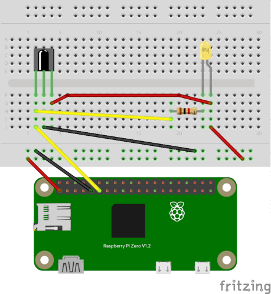

# Pi / Infrared / ir-keytable

I set out intending to add IR receiver capabilities to a Raspberry Pi Zero **cheaply** (i.e pennies not pounds).
Hopefully others will find this guide useful, as I have pulled together a number of different resources.

---

## Hardware
### Parts List
* Raspberry Pi derivative
* [vs1838b or clone Infrared receiver](./AX-1838HS.pdf)
* 1k&#x2126; resistor
* yellow led
* jumper wire
* breadboard



or you could spend a little extra and get an already wired up module, such as;<br>
https://www.amazon.co.uk/AZDelivery-Receiver-Infrared-CHQ1838-including/dp/B089QKGRTL/ref=sr_1_5?dchild=1&keywords=KY-022+Module&qid=1613066295&sr=8-5

* Physical PIN1 (3.3V) connected to positive rail of breadboard
* Physical PIN9 (Ground) connected to negative rail of breadboard
* Physical PIN11 (GPIO17) connected to signal pin of IR receiver

A good Raspberry Pi Pin-out reference can be found at https://pinout.xyz/


Power up the circuit (3.3V) and point your chosen remote control at the IR receiver module, press some buttons. All being well at this point you should have a flashing yellow led mirroring your key presses. If not check the circuit wiring and/or your remote control and re-try. Only continue onto the software set up once the hardware is functioning.

Of course the led is great for debugging the hardware circuit, but in effect all you need is the resistor spanning Vcc and Signal pins on the IR receiver. (see [spec sheet](./AX-1838HS.pdf)) I'm no expert on electronics, but this is what's known as a pull-up resistor and stops the voltage floating on the signal pin.

## Software
### Software list
* Raspbian GNU/Linux 10 (buster)
* ir-keytable
* Triggerhappy event daemon

#### Step 1.
Add the following to /boot/config.txt

```
# Uncomment this to enable the lirc-rpi module
#dtoverlay=lirc-rpi
dtoverlay=gpio-ir,gpio_pin=17
```

Note, lirc-rpi is an outdated method. gpio-ir is what's required. The GPIO pin numbering method in /boot/config.txt is the BCM method (i.e. pin 17), not the physical pin number (pin 11).

Reboot. Now you should have a /dev/lirc device in your device tree, and the gpio_ir_recv module loaded.

```
$ ls -l /dev/lirc*
crw-rw---- 1 root video 251, 0 Feb 11 21:39 /dev/lirc0

$ lsmod | grep gpio_ir
gpio_ir_recv           16384  0
```

#### Step 2. ir-keytable

Enable all protocols, clear the previous scancode to keycode mapping.
```
$ ir-keytable -p all
$ ir-keytable -c
```
test your own remote

```
$ ir-keytable -t
Testing events. Please, press CTRL-C to abort.
131064.270128: lirc protocol(necx): scancode = 0x7071b
131064.270164: event type EV_MSC(0x04): scancode = 0x7071b
131064.270164: event type EV_KEY(0x01) key_down: KEY_NEXT(0x0197)
131064.270164: event type EV_SYN(0x00).
131064.380184: lirc protocol(necx): scancode = 0x7071b
131064.380217: event type EV_MSC(0x04): scancode = 0x7071b
131064.380217: event type EV_SYN(0x00).
131064.500078: event type EV_KEY(0x01) key_up: KEY_NEXT(0x0197)
131064.500078: event type EV_SYN(0x00).
```

From this output it is possible to create your own '.toml' file which maps scancodes to keycode mappings. In my example things to note are - the protocol is **necx**, scancode of the button I pressed is **0x7071b**

My complete .toml file is [here](./custom-rds.toml)) which can act as a starting point for your own. If you scroll to the bottom of my .toml file you can see I've mapped scancode 0x7071b to "KEY_NEXT", which is reflected in the output of my test above. This file should be placed in /etc/rc_keymaps/

Reload your newly created toml file & retest.

```
$ sudo ir-keytable -c -p nec -w /etc/rc_keymaps/custom-rds.toml
$ sudo ir-keytable -t
```

Now you should see key presses on your remote mapped to events such as KEY_NEXT in my example.
Note, the reason I commented out the line '0x70702 = "KEY_POWER"' in my toml file is that this will actually cause your raspberry pi to power down - I didn't want that functionality, hence commented out.

To get all this to persist across a reboot you need to edit /etc/rc_maps.cfg
The only line required in this file is a reference to your newly created toml file, e.g.

```
$ more /etc/rc_maps.cfg
*	*	/etc/rc_keymaps/custom-rds.toml
```

There seems to be a bug with the udev creation rule in Buster 10 which stopped my changes to /etc/rc_maps.cfg taking effect after a reboot, in my case the following fixed this.

From: https://git.linuxtv.org/v4l-utils.git/tree/utils/keytable/70-infrared.rules
```
# cat /lib/udev/rules.d/60-ir-keytable.rules 
# Automatically load the proper keymaps after the Remote Controller device
# creation.
# The keycode tables rules should be at /etc/rc_maps.cfg

#ACTION=="add", SUBSYSTEM=="rc", RUN+="/usr/bin/ir-keytable -a /etc/rc_maps.cfg -s $name"
ACTION=="add", SUBSYSTEM=="input", SUBSYSTEMS=="rc", KERNEL=="event*", ENV{.rc_sysdev}="$id", RUN+="/usr/bin/ir-keytable -a /etc/rc_maps.cfg -s $env{.rc_sysdev}"
```

I also removed the 'lirc' package, as this seemed to interfere with the correct protocol loading
```
sudo apt-get remove lirc
```

Reboot.

#### Step 3. Triggerhappy event daemon

You want your key presses to do something right? I'm sure there are other ways, but a simple starting point or test would be something like triggerhappy.

```
$ sudo apt-get install triggerhappy
$ sudo echo "KEY_BLUE           1       echo BLUE >> /tmp/test" >> /etc/triggerhappy/triggers.d/test.conf
$ sudo systemctl restart triggerhappy
```

Now stick a tail on /tmp/test and press the BLUE button on your remote (assuming you mapped that key in the previous steps)

```
$ tail -F /tmp/test
BLUE
BLUE
```

You get the idea.

